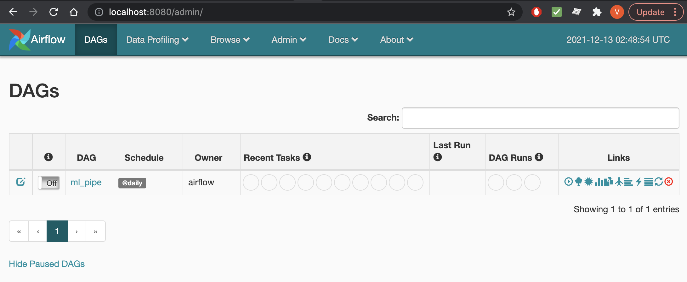
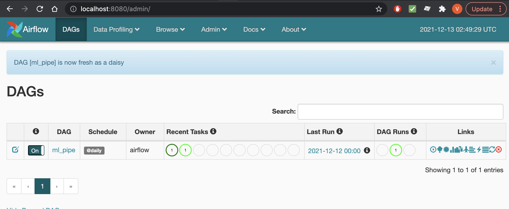

# ML Engineer Challenge - Spike 

En este repositorio se desarrolló lo necesario para abordar el desafío propuesto por Spike para el puesto de Machine Learning Engineer. Este repositorio está compuesto por dos grandes proyectos:
1. Un `pipe` de procesamiento y predicción desarrollado en Apache Airflow. Esto principalmente se encuentra en la carpeta `dags`. 
2. Una API desarrollada en Flask para generar las predicciones del modelo.

# Cómo montar el proyecto

Todo está contenido en contenedores en [`docker`](https://docs.docker.com/get-docker/). Por lo que es necesario primero tener todo instalado.

Basta con ejecutar en la consola el siguiente comando.

```docker-compose up --build```

Esto debería levantar dos endpoints:
1. El primero es el del servidor en Airflow, montado en `http://localhost:8080/admin/`
2. El segundo es el de la API, montado en `http://localhost:5000/`

# Flujo de uso
## ML-Pipe

Dentro del endpoint `http://localhost:8080/admin/` es necesario activar los DAGs. Estos ejecutaran el pipeline de procesamiento y predicción de datos. Se debe activar dentro de la interfaz
<p align="center">
    
</p>
<p align="center">
    
</p>
